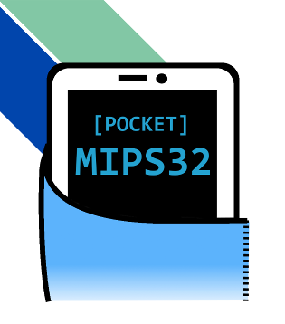
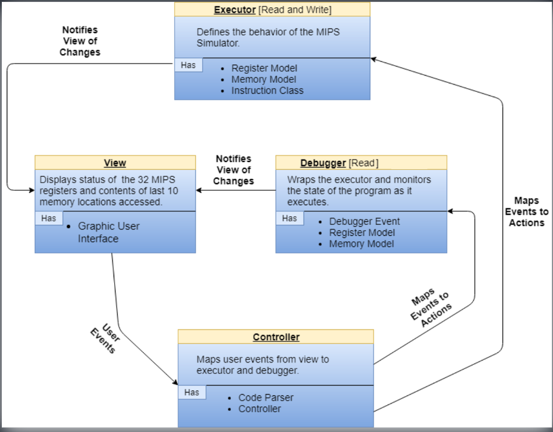

# MIPS 32 Simulator for Android
                                                                                      
                                                                                               
Programmed by Ben Hunt, James Bellian, and Aaron Hunt     
<strong> Introduction </strong>  
This Android application is part of an ongoing educational project to simulate a 32 bit MIPS architecture on mobile devices. Many Computer Science students first learn Mips 32 Assembly to understand how memory and registers are manipulated within a computers architecture. This app will provide them a way to experiment with these instructions in a simulated environment that is more accessible than alternatives like MARS. We will continue to update this application to improve stability, increase the instruction set, and add new features.   
  
<strong>Setup</strong>   To run this application on your Android device, you will need to first install Android Studio. There is currently no APK available, so the project will need to be compiled and run manually from Android Studio. Here is a tutorial that explains how to clone the project from GitHub into Android Studio using their built in Git version control https://www.youtube.com/watch?v=Y6gmmQZsuLE    
<strong>Supported Instruction Set</strong>   
The current version of the application supports a limited instruction set and does not support pseudo-instructions. Instructions currently implementated by the Executor are as follows: 
<pre>
  add Rd, Rs, Rt      
  addi Rt, Rs, imm
  addiu Rt, Rs, imm 
  addu Rd, Rs, Rt
  and Rd, Rs, Rt      
  andi Rt, Rs, imm
  beq Rs, Rt, label       
  bgez Rs, label
  bgtz Rs, label      
  blez Rs, label
  bltz Rs, label      
  bne Rs, Rt, label
  div Rs, Rt      
  divu Rs, Rt
  j label
  jal label
  jr Rs 
  li Rdest, imm 
  lw Rt, BOffset (Rs) 
  mfhi Rd 
  mflo Rd 
  mult Rs, Rt 
  or Rd, Rs, Rt 
  sll Rd, Rt, shamt
  srl Rd, Rt, shamt
  sub Rd, Rs, Rt
  sw Rt, BOffset(Rs)
   
  </pre>
  <strong> Design </strong>  
  We designed the app with a Model View Controller pattern. The Executor has a MainMemoryModel which simulates the MIPS memory layout and a RegisterModel to simulate the 32 registers and HI/LO values. Plain text Assembly code is parsed in our CodeParser which determines the encoding of the instruction by the instruction and its arguments. The encoding is then sent in the form of an int array to the Executor which then executes the instruction updating values in register and memory as needed. The following UML diagram shows the relationship between these classes:

  
  
